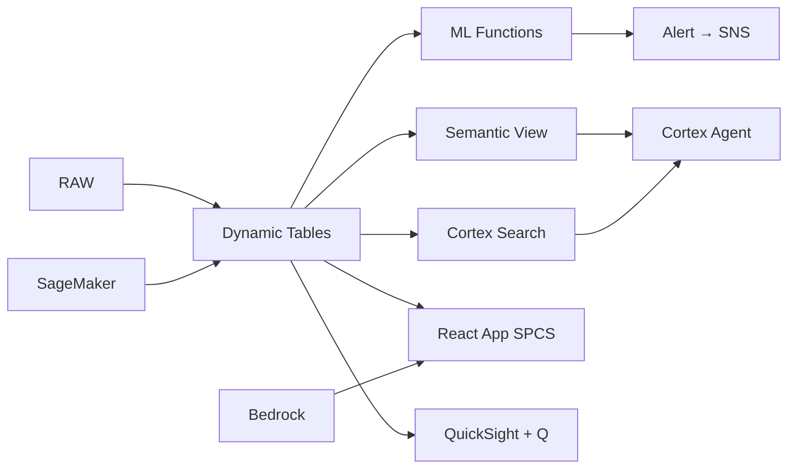

# BSP Regulatory Reporting & Compliance Automation

Philippine banks submit 200+ reports to BSP quarterly — Snowflake automates regulatory data preparation with Task Graphs, parses regulatory circulars with AI, and enables compliance teams to query requirements in natural language.

## Architecture

Philippine banks submit 200+ regulatory reports to BSP every quarter — Financial Reporting Package, CAMEL ratings, DOSRI disclosures, capital adequacy, liquidity coverage, stress tests, and more. One universal bank's compliance team of 45 people spends 60% of their time on manual data preparation. Reports still fail BSP validation 15% of the time, triggering exam findings. Snowflake automates the entire pipeline while AI makes 450 BSP circulars instantly searchable.



## Snowflake Capabilities

| Capability | Implementation |
|-----------|---------------|
| Dynamic Tables | REPORT_READINESS / RECONCILIATION_STATUS / FINDING_TRACKER / COMPLIANCE_CALENDAR |
| ML Functions | ML.CLASSIFICATION + ML.ANOMALY_DETECTION |
| Cortex AI | AI_PARSE_DOCUMENT, AI_CLASSIFY, COMPLETE |
| Cortex Search | 450 documents indexed |
| Cortex Agent | COMPLIANCE_INTELLIGENCE_AGENT |
| Semantic View | COMPLIANCE_ANALYTICS |
| React App (SPCS) | 5 tabs + DemoGuide |


## AWS Services

| Service | Role in Demo |
|---------|-------------|
| Amazon Textract | Parse new BSP circulars and regulatory documents |
| AWS Step Functions | Orchestrate multi-step report generation workflows |
| Amazon SageMaker | Predict report validation failures |
| Amazon Bedrock (Claude) | Generate compliance gap analysis and remediation narratives |
| Amazon QuickSight + Q | Compliance dashboard for regulatory team |
| Amazon SNS | Alert compliance team on deadline and quality issues |


## Personas

| Persona | Role | Key Questions |
|---------|------|---------------|
| **Atty. Corazon Mercedes Aquino** | Chief Compliance Officer | "How many reports are due this month?" "Which reports failed validation checks?" |
| **Fernando Jose Ramirez** | Regulatory Reporting Manager | "Which data sources have reconciliation gaps?" "Show me the error rate trend for CAMEL submissions." |


## Data

| Table | Rows | Description |
|-------|------|-------------|
| REPORT_CATALOG | 210 | BSP report definitions (FRP, CAMEL, DOSRI, stress testing, etc.) |
| SUBMISSION_HISTORY | 4,800 | 3 years of report submissions with status and findings |
| FINANCIAL_DATA | 8,500,000 | General ledger and subledger data for report generation |
| BSP_CIRCULARS | 450 | BSP circulars, memoranda, and regulatory requirements |
| EXAM_FINDINGS | 280 | BSP examination findings with remediation status |
| RECONCILIATION_DATA | 1,200,000 | Cross-system reconciliation records |
| VALIDATION_RULES | 3,500 | BSP data validation rules per report type |


## Build Instructions

### Prerequisites
- Snowflake account with ACCOUNTADMIN access
- Cortex AI enabled (ML Functions, Search, Agent)
- Warehouse: COMPLIANCE_WH (Medium)
- AWS CLI with access (us-west-2)

### Deployment

```bash
snowsql -f snowflake/00_setup.sql
snowsql -f snowflake/01_marketplace_install.sql
snowsql -f snowflake/02_raw_tables.sql
snowsql -f snowflake/03_staging.sql
snowsql -f snowflake/04_dynamic_tables.sql
snowsql -f snowflake/05_search.sql
snowsql -f snowflake/06_ml_models.sql
snowsql -f snowflake/07_semantic_view.sql
snowsql -f snowflake/08_agent.sql
```

### React App (SPCS)
```bash
cd app && npm ci && npm run build
docker build -t aws-philippines-banking-bsp-regulatory-app .
docker push bdiqc8sm-default.registry.snowflakecomputing.com/regulatory_reporting/app/aws_philippines_banking_bsp_regulatory/app:latest
```

### Demo Mode
Open the app URL with `?demo=true` for presenter view.

## Build Modes

### Snowflake Only
Run scripts 00-08 (skip AWS-specific integration). Uses:
- **AI_PARSE_DOCUMENT (native)** instead of Amazon Textract
- **Task Graphs (DAG orchestration)** instead of AWS Step Functions
- **ML.CLASSIFICATION (native)** instead of Amazon SageMaker
- **Cortex Complete** instead of Amazon Bedrock (Claude)
- **Snowflake Intelligence (Cortex Analyst)** instead of Amazon QuickSight + Q
- **Alerts + Notification Integration** instead of Amazon SNS

### Full AWS + Snowflake
Run all scripts including AWS integration. Deploy QuickSight dashboard from `quicksight/`.

## Business Impact

Industry research and Snowflake customer outcomes:
- **Philippine banks face ₱500K-₱10M penalties per report filing violation** — [BSP](https://www.bsp.gov.ph/Regulations/banking.aspx)
- **Banks spend 40-60% of compliance budget on manual regulatory reporting** — [Deloitte RegTech](https://www2.deloitte.com/global/en/pages/financial-services/articles/gx-regulatory-management.html)
- **Automated regulatory reporting reduces errors by 70-90% and cost by 50%** — [McKinsey Banking](https://www.mckinsey.com/industries/financial-services/our-insights)
- **BSP supervises 500+ banks and issues 50-80 new circulars annually** — [BSP](https://www.bsp.gov.ph/Regulations/Issuances/Circulars.aspx)
- **Western Union** (Snowflake customer): processes 1B+ cross-border transactions on Snowflake with real-time compliance and fraud detection -- [snowflake.com/customers/western-union](https://www.snowflake.com/en/customers/all-customers/case-study/western-union/)

## Key Demo Numbers

- **210 reports** regulatory filings due per quarter
- **38 reports** due within next 2 weeks
- **12 reports** predicted to fail BSP validation (ML.CLASSIFICATION)
- **450 circulars** parsed and searchable via Cortex Search
- **14 findings** outstanding BSP exam findings
- **4 hours** automated report generation (vs 3 days manual)


## License

Apache 2.0 — See [LICENSE](LICENSE) for details.

This is a personal demo project and is not an official Snowflake offering. It comes with no support or warranty.